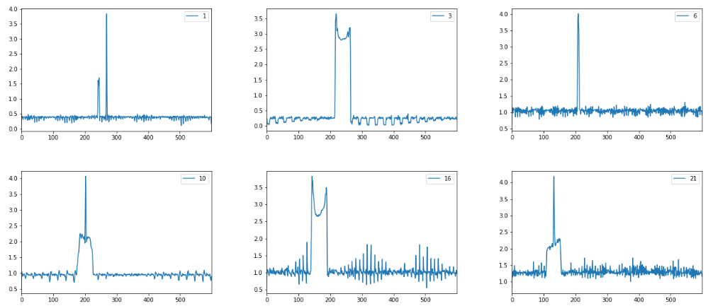

# GAIT ANALYSIS 

## ABSTRACT
Gait Analysis is essential to study of human motion; we intend to understand the typical human walking pattern and provide treatment if this pattern has changed over time. The experimental setup consists of 25 infrared cameras spaced at 4 inches (0.1 m) apart. The research includes data preprocessing step, image segmentation, and edge detection to extract features like gait speed, stride, and step length. The features determined from the walking pattern will provide valuable data for additional analysis.

## INTRODUCTION
To better understand this research, we need to have a grasp of the gait cycle and gait analysis. This paper outlines an overview of the different gait cycles and gait analysis. The essential criteria for gate analysis are to observe the patients from the front, back, and sides to give a more detailed analysis of walking features. This experimental setup was carried out with infrared sensors to detect the distance of each foot as the subject walks across the sensors. The setup consists of 25 infrared sensors spaced at 4 inches (0.1 m) apart, roughly a total distance of ~3m. Before we go on to analyze, let us talk about the gait cycle. We are focusing on the right gait cycle i.e.; we are following the right leg during a full stride. Some basic terminologies include steps and strides. A step starts with the initial contact of one foot and ends with initial contact of the other foot. The stride starts with initial contact of one foot and ends with the next initial contact of the same foot, while a step is essentially half of the stride. Let's now begin by looking at the two phases of the gait cycle. There is a stance phase that makes up roughly 60% of the gait cycle. During this phase, the right foot is always in contact with the floor. During the heel strike (first initial contact), the right leg expects the weight of the body, also known as loading response, marks the first 10% of the gait cycle. The load response ends once the contralateral foot lifts off the ground(single-limb support). Following the load response, up until the point of heel off, we are in Mid-stance, reaching 30% of the gait cycle. Once the heel of the right foot starts to lift while the contralateral leg has initial contact with the ground, this period is called the Terminal stance(50% of the gait cycle). While the contralateral leg is proceeding to make full contact with the ground, the right leg lifts off further off the ground. This phase is called pre-swing, and we reach 60 percent. The stance phase is now complete, and we start the swing phase. In the swing phase, which makes up 40% of the gait cycle, the right leg is swinging. The   swing phase  has 3 central regions – initial swing(heel off until toes are adjacent -73 % of the gait cycle), mid-swing(until tibia is vertical -87% of the gait cycle) and terminal swing (ends with the heel strike if the right leg -100 % of the gait cycle)

The pattern obtained from the raw data is as shown. We can identify both the legs. The brighter shapes are the right legs (NF -Near Foot) of the subjects, as it was the closest to infrared sensors, and the other two represent the left leg (FF- Far Foot) and identify the swing in the background. An important thing to note is that since we have infrared sensors on one side, we obtain a more evident right foot pattern.

Each walk pattern consists of the 600 x 25 cells. The x-axis represents the link indices, and the y-axis represents time as measured in samples (sampled at 60 Hz). Therefore, the time axis goes from 0 seconds (at the Top) to 10 seconds (at the bottom).
Another way to look at this pattern is to show the output of each sensor. We can see output few selected sensors(1,3,6,10,16,21) . Sensor 1 shows both the right and left swing of feet. The more prominent spike represents the right swing. The output from sensor 3,16 shows a portion of the right foot on the ground with some spike in the background most likely captured a swing of the left foot. Sensor 6 shows only the right foot swing. Sensor 10,21 shows the left foot on the ground, with the swing of the right foot — sensor 16,21 like 3 and 10, respectively.

We can also look at the pattern from all sensors cumulatively. By image processing and shape detection. We can calculate the following information from the image. 
- The Walking speeds.
- The Stride length.
- The Step length.

## DATA PREPROCESSING
In this step, we obtain a clean and organized data ready for use. The data due to the 25th sensor module was removed as it does not give any useful information for image processing and once, we got rid of bad data; we obtain a final count of  374 walk patterns.
The next step is to take the image histogram to get the spread of pixel intensity values. The histogram of the grayscale image – and we apply to preprocess steps to improve the image. From the image and histogram, it is clear there is much noise in the image. Hence, we need to remove some of the noise; one such method was to normalize the image by subtracting the background noise. We achieved this by subtracting the mean of background error from raw data(image). The resulting image is an improvement from the raw image and a considerable reduction in the noise.

We can notice a clear distinction and improvement in the image, and noticeable improvement in the histogram as well.

## IMAGE SEGMENTATION AND EDGE DETECTION
This step, we change the representation of our image. We try to locate objects and boundaries in images. We can achieve this by first filtering the image to remove noise and then using thresholding. The application of thresholding will turn the grayscale image into a binary image. It is from the binary image we can detect edges. The drawback of this is that patterns are overlapping, and we cannot obtain the desired edges. So, the key is to select the threshold values (or values for multiple levels), which can retain the excellent image information and detect desired edges. We tried with real-time analysis, and we can change the values of the threshold as per our requirement to get the best edges without loss of data. The problem with this is that we cannot find one value of threshold that fits all walk patterns. The experiment was conducted on all 374 data to try to obtain all edges. However, simple thresholding is not enough to get the right binary image; there is a loss of data and hence unable to detect edges accurately. We also used the Canny edge detector to see if we can get improved performance and the most accurate result. We select high and low threshold values, and If an edge pixel's gradient value is higher than the high threshold value, it is an edge. If an edge pixel's gradient value is smaller than the high threshold value and more significant than the low threshold value, it is a weak edge pixel. The edge pixel's value is suppressed when it is lower than the low threshold value, it will be suppressed. This, too, also has similar limitations since the threshold varies too much with different images, its unable to pinpoint what threshold fits the image. We instead used another method called watershed segmentation, an algorithm used when images or shapes have boundaries that are overlapping. These were the following steps used to determine the boundary of ROI:
- Otsu Binarization – Finding an approximate estimate of the pattern.
- Morphological opening – Removes any small white noises in the image.
- Distance transform.
- Sure Foreground – Applying a proper threshold to the distance transform.
- Sure Background – Applying dilation to opening.
- Boundary – Obtained by subtracting foreground and background.

## CONTOURS
Contours are a curve joining all the consecutive points(along the boundary), having the same color or intensity. The contours are a useful tool for shape analysis and object detection and recognition. After obtaining a binary image from the previous step. We use the computer vision library from python to be able to create a bounding box around the target once the contours detected around the edges of the binary input image. We select the contour, which is the most desirable contour and create a bounding box around the specific contour. For our research, we created two types of bounding rectangles. Regular bounding rectangle and rotated rectangle. The figure shows both types of rectangle over the region of interest(ROI). The straight rectangle does not consider the rotation of the object. The rotated rectangle considers the rotation and drawn with the minimum area.

## RESULT AND CALCULATION

## CALCULATIONS OBTAINED :  
- VELOCITY      :   1.11 m/s
- STEP LENGTH   : 	0.63 m
- STRIDE LENGTH :   1.38 m

# Note
For testing purpose only sample images were included and not entire data set

